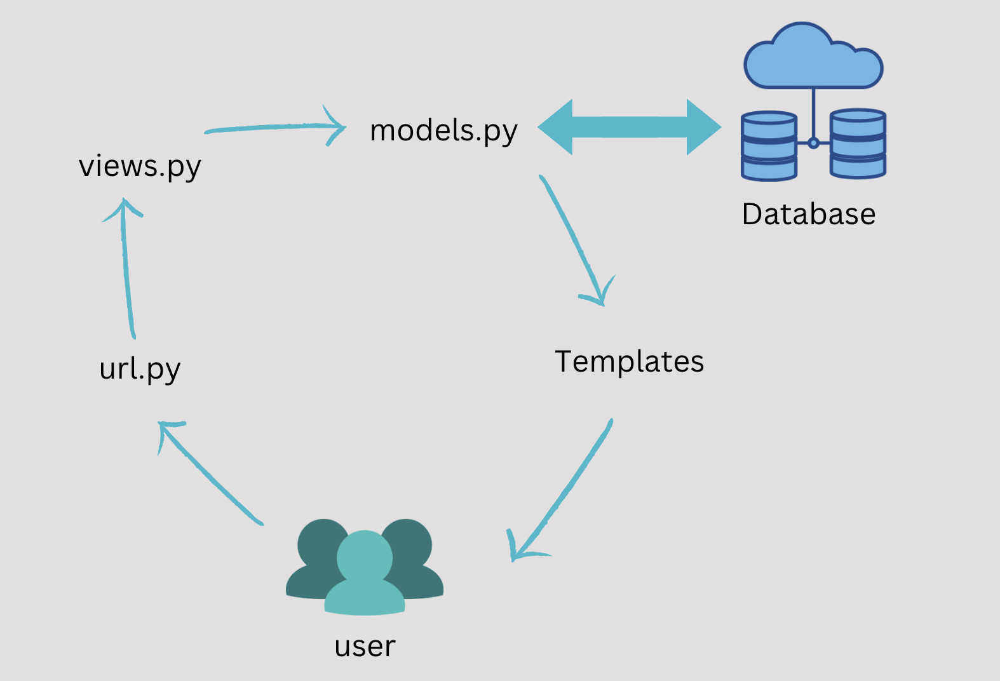

# Aplikasi
Aplikasi dari Katalog terdapat dalam link: [https://eda-pbp-tugas-2.herokuapp.com/katalog/]

# Jawaban

### 1. Buatlah bagan yang berisi *request client* ke web aplikasi berbasis Django beserta responnya dan jelaskan pada bagan tersebut kaitan antara **urls.py**, **views.py**, **models.py**, dan berkas **html**;

1. User yang tersambung dengan internet membuat permintaan kepada Django
2. Permintaan tersebut diproses dalam bentuk urls.py dan dihandle oleh views.py yang ada
3. Jika dibutuhkan untuk memakai data pada database, maka views akan memanggil query ke models.py dan dikembalikan lagi ke views
4. Setelah semua permintaan sudah terpenuhi, maka views akan meneruskannya ke file HTML yang ada
5. HTML yang sudah terdefinisi dikembalikan ke user

### 2. Jelaskan kenapa menggunakan *virtual environment*? Apakah kita tetap dapat membuat aplikasi web berbasis Django tanpa menggunakan *virtual environment*?

* Virtual environment merupakan suatu environment yang diperuntukan untuk sebuah aplikasi dijalankan. Virtual environment berfungsi sebagai alat yang memisahkan dependencies antara projek-projek yang ada. Kelebihan dari pemisahan virtual environment ini adalah jika ada perubahan dalam suatu projek, maka tidak akan memengaruhi projek lainnya. Hal ini menjawab pertanyaan apakah kita dapat membuat aplikasi tanpa menggunakan virtual environment, dan jawabannya adalah bisa! Namun, akan sangat rentan akan error dan tidak dianggap sebagai best practice dalam pemrograman. Sebagai contoh, jika project1 dan project2 memilki versi Django yang berbeda tetapi diletakkan dalam nama directory yang sama, error akan dapat muncul jika tidak ada pemisahaan virtual environment.

### 3. Jelaskan bagaimana cara kamu mengimplementasikan poin 1 sampai dengan 4 di atas.

* Proses implementasi diawali dengan melakukan clone repositori Github Fasilkom UI ke repositori lokal laptop pribadi. Hal ini dikarenakan oleh Django bertindak sebagai template untuk mengembangkan aplikasi/website. Repositori yang sudah dibuat, lalu akan dijalankan modifikasi-modifikasi atas file yang terkandung di dalamnya. Proses selanjutnya merupakan implementasi yang mengikuti struktur MVT (Model-View-Template).
* Sebelum memulai, alangkah baiknya untuk menggunakan dan mengaktifkan Python virtual environment dan mengunduh dependencies yang diperlukan. Lalu, menjalankan perintah manage.py makemigrations, migrate, dan loaddata file json katalog.
* Langkah selanjutnya adalah untuk mengimplementasi views pada file views.py. Views.py diisi agar dapat mengembalikan konten-konten yang direquest oleh browser untuk file katalog.html. Lalu, mendaftarkan aplikasi katalog ke urls.py yang terletak di folder project_django.
* Selanjutnya, diperlukan untuk menghubungkan models dengan views dan template. Untuk itu, diperlukan untuk mengimport models dari CatalogItem. Serta, tambahkan potongan kode context, berisi nama, npm, dan list barang yang nantinya akan di return.
* Lalu, bukalah file HTML yang tertdapat pada folder templates dan gantilah “Fill me!” dengan variable dan elemen dari view.py. Selanjutnya, lakukan iterasi atas barang dari list_barang yang telah di render dalam HTML.
* Terakhir, dilakukan deploy aplikasi katalog ini ke Heroku agar bisa diakses secara global.
